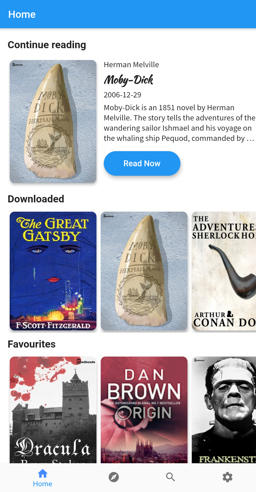
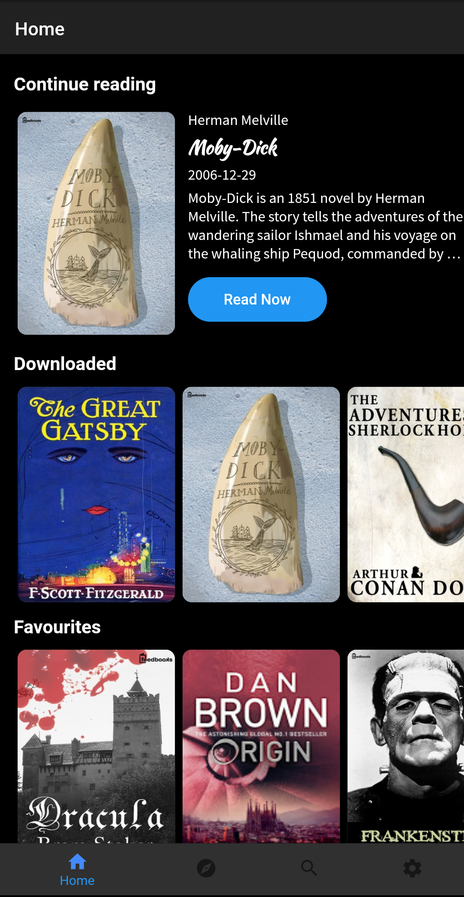
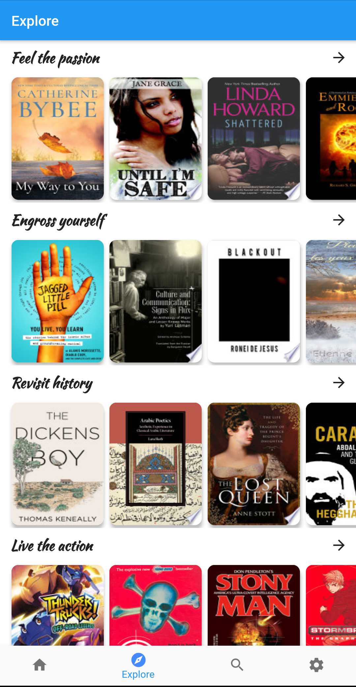
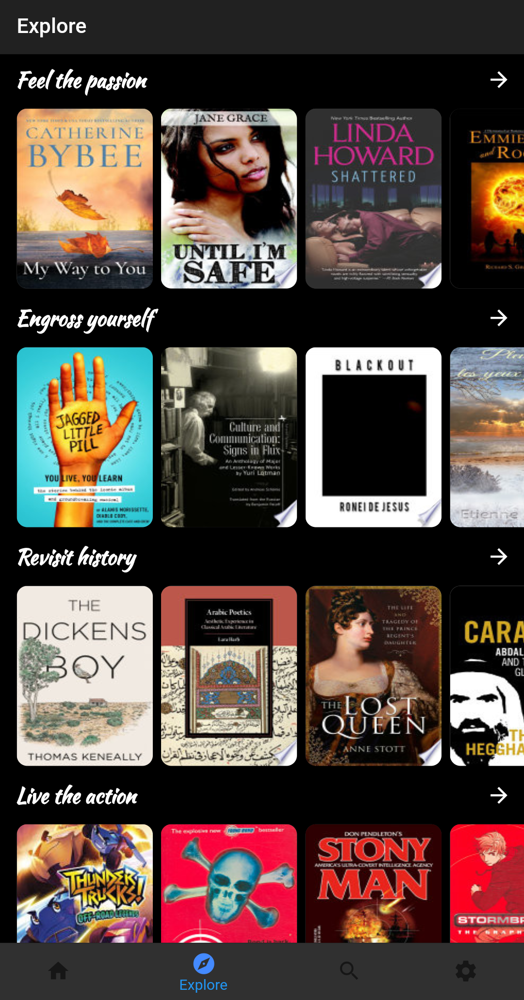
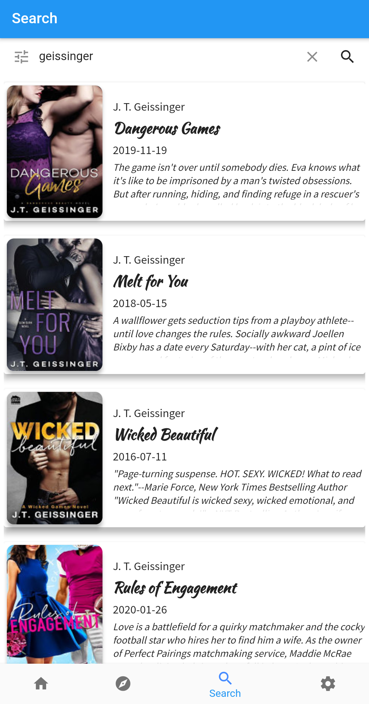
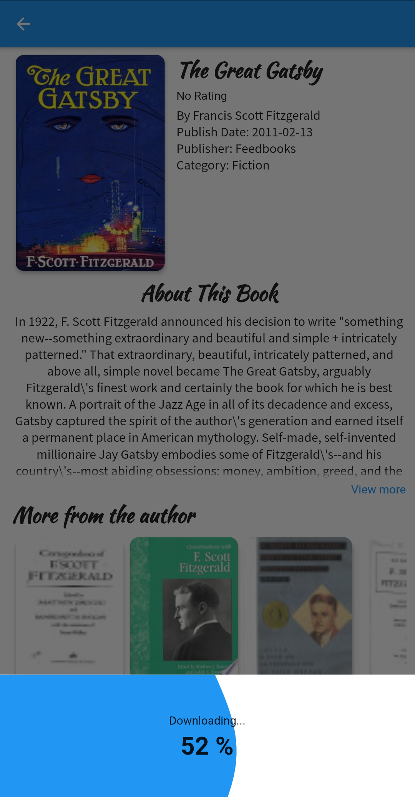
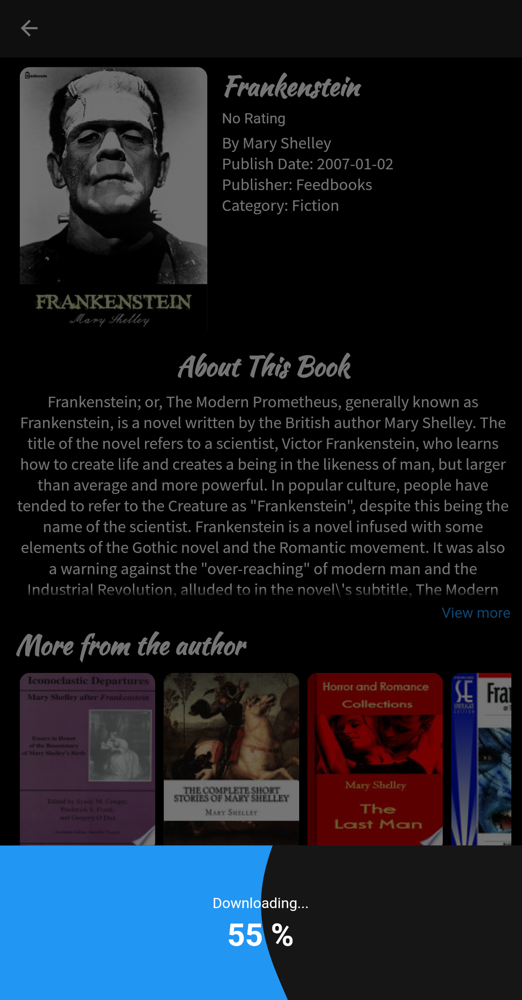

# 📖📖 Bookie 

A simple Flutter app to Read and Download books.
The Books included in the app are from the [Public Domain](https://en.wikipedia.org/wiki/Public_domain) (Expired Copyright and completely free).

<a href="https://play.google.com/store/apps/details?id=com.onuifeanyi.bookie"></img></a>
 
Please star⭐ the repo if you like what you see😉.

## 💻 Requirements
* Any Operating System (ie. MacOS X, Linux, Windows)
* Any IDE with Flutter SDK installed (ie. IntelliJ, Android Studio, VSCode etc)
* A little knowledge of Dart and Flutter

## ✨ Features
- [x] Download eBooks.
- [x] Read eBooks.
- [x] Dark Mode.

## 📸 ScreenShots

| Light| Dark|
|------|-------|
|||
|||
|||
|||

## 🔌 Plugins
| Name | Usage |
|------|-------|
|[**Provider**](https://pub.dev/packages/provider)| State Management|
|[**Object DB**](https://pub.dev/packages/objectdb)| NoSQL database to store Favorites & Downloads|
|[**Xml2Json**](https://pub.dev/packages/xml2json)| Convert XML to JSON|
|[**Dio**](https://pub.dev/packages/dio)| Network calls and File Download|
|[**Http**](https://pub.dev/packages/http)| Network calls|
|[**EPub View**](https://pub.dev/packages/epub_view)| A flutter plugin to read ePub files|

## 🤓 Author(s)
**Onuoha ifeanyi.**  <a href="https://twitter.com/onuoha_ifeanyi">Follow me</a> on Twitter.
